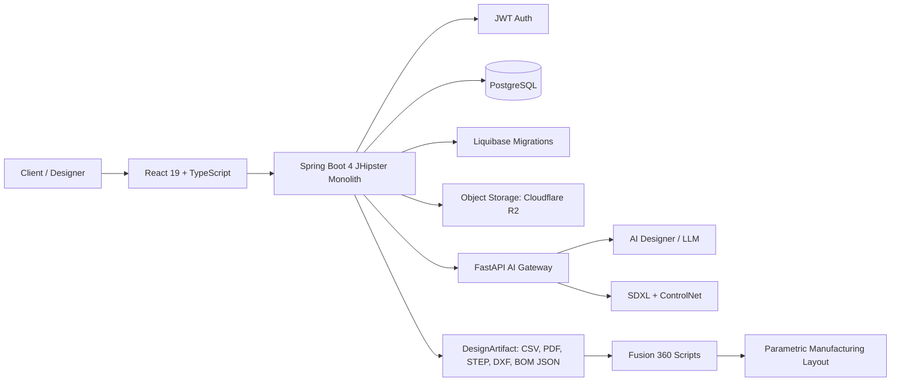

# Kalitron Furniture Studio

AI-powered kitchen and closet design studio that turns a client conversation into structured specs, visual concepts, quotes, and Fusion 360-ready fabrication artifacts.

[](https://www.jhipster.tech/)
[](https://spring.io/projects/spring-boot)
[](https://openjdk.org/)
[](https://react.dev/)
[](https://www.typescriptlang.org/)
[](https://www.postgresql.org/)
[](LICENSE)

## Demo Preview

The planned demo flow is:

```text
Login -> New design session -> AI chat -> Reference photo -> Style selection
      -> Visual concept -> Proposal -> Fusion 360 CSV/artifacts
```

Demo screenshot is pending until the E2/E3 chat and visual concept screens are complete.

## Architecture



The Spring Boot monolith owns authentication, sessions, domain data, quotes, proposals, and generated CRUD. The FastAPI gateway owns AI/model execution. Fusion 360 integration is artifact-based: the app exports structured CSV/artifacts from validated specs rather than treating AI renders as fabrication truth.

AI Gateway repository: [outis10/kalitron-furniture-ai-gateway](https://github.com/outis10/kalitron-furniture-ai-gateway)

## Features

- JWT-secured JHipster monolith with React frontend.
- AI-guided design sessions for kitchens and closets.
- Persistent chat history and structured design specifications.
- Reference image and render metadata through `DesignImage`.
- txt2img concept generation path for prompt-only designs.
- img2img concept generation path for uploaded client photos.
- SDXL + ControlNet Canny strategy for preserving room structure.
- Catalog styles for visual design inspiration.
- Room geometry modeling with walls and obstacles.
- Cabinet templates, cabinet instances, and cabinet parts for BOM/cut-list workflows.
- Materials and hardware catalogs for quote inputs.
- Quote and quote item model for proposal workflows.
- `GenerationJob` tracking for long-running AI, BOM, quote, and Fusion export operations.
- `DesignArtifact` model for CSV, PDF, STEP, DXF, Fusion scripts, and BOM JSON outputs.
- PostgreSQL in development and production to support PostgreSQL-specific features such as fuzzy search, full-text search, `pg_trgm`, and future `pgvector`.

## Tech Stack

| Layer            | Technology                                                                                             |
| ---------------- | ------------------------------------------------------------------------------------------------------ |
| Backend          | Spring Boot 4, Java 21, Gradle                                                                         |
| Frontend         | React 19, TypeScript, Webpack                                                                          |
| Platform         | JHipster 9.0.0 monolith                                                                                |
| Auth             | JWT stateless authentication                                                                           |
| Database         | PostgreSQL for development and production                                                              |
| Migrations       | Liquibase                                                                                              |
| API Docs         | OpenAPI / Swagger UI                                                                                   |
| Mapping          | MapStruct DTO mappers                                                                                  |
| Tests            | JUnit 5, Jest, Cypress-ready JHipster structure                                                        |
| AI Gateway       | [FastAPI Python service](https://github.com/outis10/kalitron-furniture-ai-gateway) on `localhost:8000` |
| Image Generation | SDXL, ControlNet Canny, txt2img, img2img                                                               |
| Object Storage   | Cloudflare R2 strategy                                                                                 |
| Fabrication      | Fusion 360 scripts consuming generated CSV/artifacts                                                   |

## Domain Model

The core workflow is:

```text
DesignSession
  -> ChatMessage
  -> KitchenSpec
  -> RoomWall / RoomObstacle
  -> CabinetTemplate / Cabinet / CabinetPart
  -> DesignImage / DesignArtifact / GenerationJob
  -> Quote / QuoteItem
```

The source JDL is in [`kitchen.jdl`](kitchen.jdl).

## Getting Started

Prerequisites:

- Java 21
- Node.js 22.22.2
- Docker with Compose
- PostgreSQL through the provided Docker Compose service
- Optional: [FastAPI AI gateway](https://github.com/outis10/kalitron-furniture-ai-gateway) running at `http://localhost:8000`

Run locally:

```bash
nvm use
npm install
docker compose -f src/main/docker/postgresql.yml up -d
rm -rf build/webpack
./gradlew
npm run start
```

Open:

- App: http://localhost:9000
- Backend: http://localhost:8080
- Swagger UI: http://localhost:8080/swagger-ui/index.html

Useful validation commands:

```bash
./gradlew test integrationTest jacocoTestReport
rm -rf build/webpack && npm run webapp:build:dev -- --env stats=minimal
```

Production build:

```bash
./gradlew -Pprod clean bootJar
```

## Configuration

Key environment variables:

```bash
DATABASE_URL=jdbc:postgresql://localhost:5432/kalitron
DATABASE_USERNAME=kalitron_user
DATABASE_PASSWORD=<secret>
FASTAPI_URL=http://localhost:8000
FUSION_SCRIPTS_DIR=C:/AI/FusionScripts
OUTPUT_DIR=./outputs
```

Production credentials must be supplied through environment variables or deployment secrets. They should never be committed to git.

## Roadmap

| Milestone                                                                                               | Goal                                                                           | Status      |
| ------------------------------------------------------------------------------------------------------- | ------------------------------------------------------------------------------ | ----------- |
| [v0.1 Project Setup & Infrastructure](https://github.com/outis10/kalitron-furniture-studio/milestone/1) | JHipster foundation, PostgreSQL, CI, ADRs, README                              | In progress |
| [v0.2 Design Chat & Conversation](https://github.com/outis10/kalitron-furniture-studio/milestone/2)     | Multi-turn AI chat, session management, reference photo upload, catalog styles | Planned     |
| [v0.3 Visual Concept Generation](https://github.com/outis10/kalitron-furniture-studio/milestone/3)      | SDXL txt2img/img2img, ControlNet, persisted generated images, resume sessions  | Planned     |
| [v0.4 End-to-End Demo](https://github.com/outis10/kalitron-furniture-studio/milestone/4)                | Login -> chat -> concept -> proposal, Cypress E2E, portfolio-ready demo        | Planned     |

## Architecture Decisions

ADRs live in [`docs/adr`](docs/adr):

- [ADR-001: Use a JHipster Monolith Instead of Microservices](docs/adr/ADR-001-monolith-vs-microservices.md)
- [ADR-002: Separate the AI Gateway as FastAPI Instead of Implementing AI Runtime in Java](docs/adr/ADR-002-ai-gateway-fastapi-vs-java.md)
- [ADR-003: Use Local ComfyUI/SDXL First, Keep Cloud GPU APIs as an Escape Hatch](docs/adr/ADR-003-comfyui-vs-cloud-apis.md)
- [ADR-004: Use Cloudflare R2 for Object Storage Instead of AWS S3](docs/adr/ADR-004-cloudflare-r2-vs-s3.md)
- [ADR-005: Integrate Fusion 360 Through Generated CSV and Artifacts](docs/adr/ADR-005-fusion-360-integration-strategy.md)

## Development Notes

- Custom backend endpoints should go under `web/rest/custom/`.
- Generated JHipster CRUD under `src/main/webapp/app/entities/` should not be hand-edited except for regeneration fixes.
- Business logic belongs in services, not REST resources.
- Do not return JPA entities directly from custom APIs; use DTOs.
- Uploaded files and generated binaries should be stored externally and referenced through `DesignImage` or `DesignArtifact`.

## License

This project is licensed under the MIT License. See [`LICENSE`](LICENSE).
